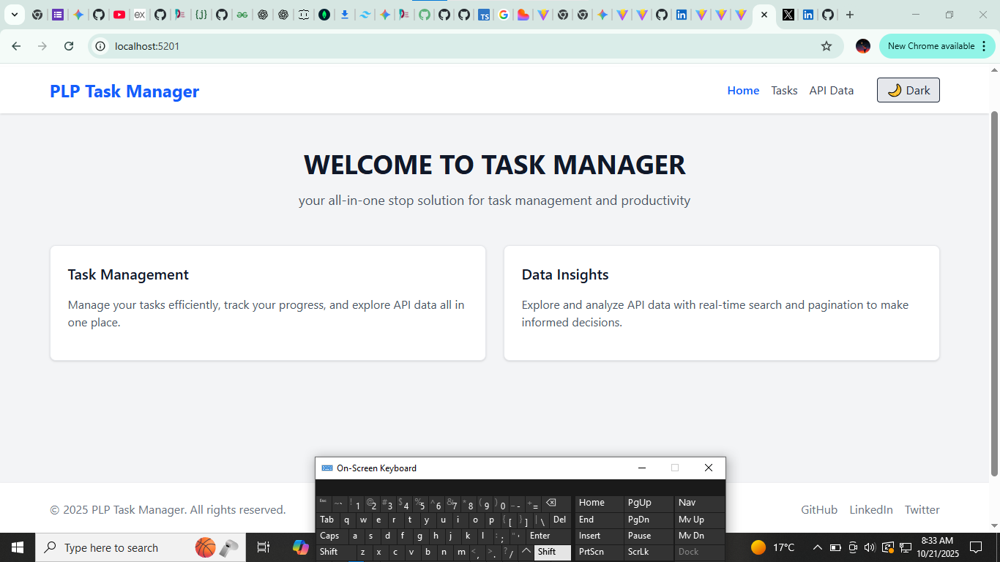

## 🗂️ PLP Task Manager

A simple and responsive **Task Manager** built with **React.js** and **Tailwind CSS**.  
This application allows users to manage tasks efficiently, view API data, and switch between light and dark themes.

---

## 🚀 **Features**

- 📝 Add, delete, and filter tasks  
- 💾 Persistent storage using `localStorage`  
- 🌐 Fetch and display data from a public API (JSONPlaceholder)  
- 🔍 Search functionality for filtering API results  
- ♾️ Pagination for API data  
- 🌙 Light/Dark mode using React Context and Tailwind CSS  
- 📱 Fully responsive on mobile, tablet, and desktop  

---

## 🏗️ **Project Structure**

src/
├── api/ # API integration (fetch from JSONPlaceholder)
├── components/ # Reusable UI components (Navbar, Footer, Card, etc.)
├── context/ # Theme context (light/dark mode)
├── hooks/ # Custom hooks (useLocalStorage)
├── pages/ # Pages (Home, Tasks, API Data)
|
└── App.jsx # Main application component


---

## ⚙️ **Setup Instructions**

Follow these steps to run the project locally 👇

### 1️⃣ Clone the Repository
```bash
git clone <your-repo-url>


🧩 Technologies Used

⚛️ React.js (with Vite)

💨 Tailwind CSS

🪝 React Hooks (useState, useEffect, useContext)

📦 Custom Hook: useLocalStorage

🌐 JSONPlaceholder API (https://jsonplaceholder.typicode.com
)

🌓 Context API for theme management


🌍 Deployment

The app is deployed on GitHub Pages:

🔗 Live Demo: [Your GitHub Pages Link Here]

🖼️ Screenshots
🏠 Home Page



✅ Tasks Page
[Tasks Page](./screenshots/tasks.png)


🌐 API Data Page
[ApiData Page](./screenshot/api.png)


📜 License

This project is for learning purposes under the PLP course.
All rights reserved © 2025 PLP Task Manager.
